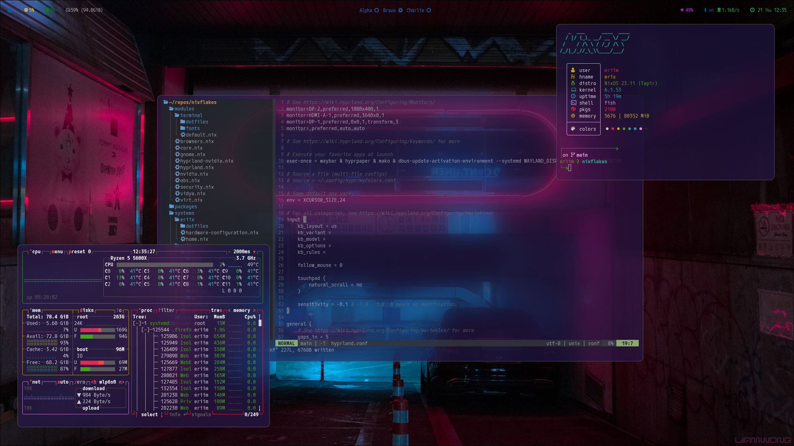

> :warning: **Disclaimer:** These are *machine specific flakes*. You *WILL* run into errors if you attempt to flake from this repo and you are not using my machines.

## Eriim's Nixflakes

This repo contains pure nix modules that can be imported to other Nix systems using a similar configuration. 

Modules are grouped by *functionality* and as such you will often find both the system configuration and the home-manager configuration in the same place. Not all Nix users will use this paradigm.

Some modules will require you to flake your configuration to fully use them, they have non-flaked counterparts. This includes:

Requires Flake:

- [hyprland-nvidia.nix](https://github.com/erictossell/nixflakes/blob/main/modules/hyprland-nvidia.nix)

Non Flake alternative:

- [hyprland.nix](https://github.com/erictossell/nixflakes/blob/main/modules/hyprland.nix)

### To be done 

    - Remove hardcoded values and pass via flake ie: username, hostname, etc

## Screenshots 

### My Nixdots contain configurations for:

##### Core Modules

    - Browser(s): Firefox, Chromium, Nyxt 
    - IDE: VSCode

##### Security : 

    # Security modules require additional set up beyond what is included in this repo.
    # Refer to the NixOS wiki for further documentation

    - 1Password for SSH Authentication
    - Yubico Key 2FA

##### Terminal Module 

    - Editor: Neovim
    - Terminals: Foot, alacritty, wezterm   

##### Profiles

1. Desktop (erix-hyprland)

    - WM: hyprland
    - All core modules + nvidia

2. Desktop (erix-gnome)

    - DE: Customized Gnome w PopShell for a WM experience
    - All core modules + nvidia

3. Laptop (eriix) [ Slightly stripped down version of my desktop ]

    - WM: hyprland
    - Most core modules (no virt)   

4. TBD (server farm) 

    - My Nix home server is WIP.

## Gnome

I use a highly customized Gnome desktop environment with Popshell for window management. This involves modifying a number of default mutter settings and it managed on a per user basis. This means we have to involve home-manager to accomplish this.

My gnome modules do not require flaking but I do not actively test them regularily.

###### Disabling Hyprland
Enabling Gnome does require disabling Hyprland due to conflicts with differing XDG portals. Hopefully this will be fixed in the near future.

Thanks to the nature of NixOS this is trivial and the two modes can be interchanged reliably. 

Doing this often will have an impact on your SSD lifetime.
