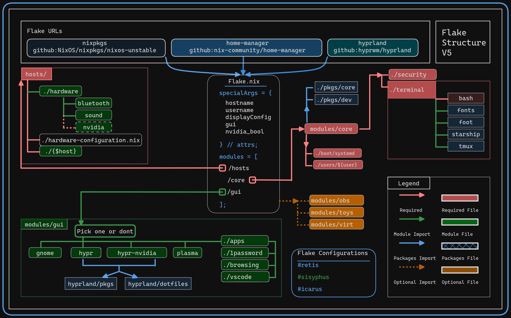
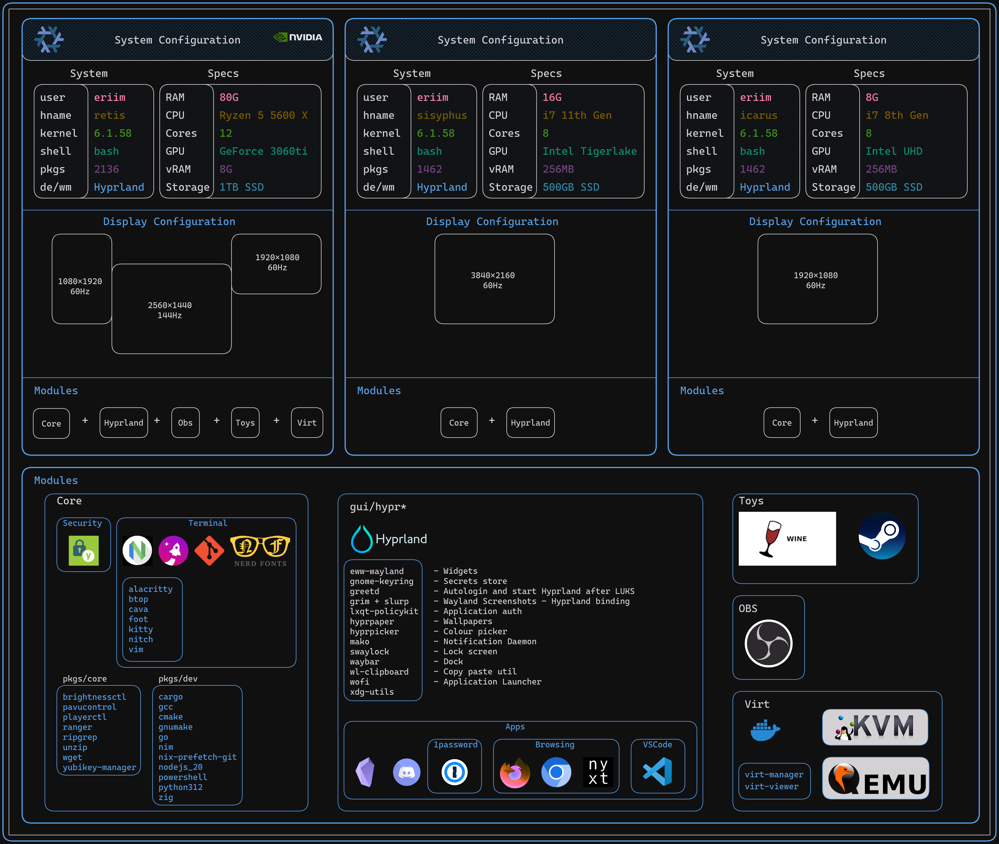

# Eriim's Nixflakes

### Flake Structure
Modules are grouped to be almost purely *functional* and as a result you will often find both the system configuration and the home-manager configuration in the same place. Not all Nix users will this paradigm.             

This repo has become more opinionated over time and now requires passing down variables from the `flake.nix` in order to grab appropriate modules and packages. This area is heavily WIP.





### To Be Done

- SOPS for nixsecrets

## Screenshots


### My Nixdots Contain Configurations for

#### Core Modules
  - Browsers (Firefox, Chrome, Nyxt)
  - Nvidia
  - [OBS Studio](https://obsproject.com/) (for screen recording and streaming/sharing screen)
  - Security Config ([1Password](https://1password.com/), [Yubico](https://www.yubico.com/) Authentication)

#### Extra Toys
- Vidya (Steam, Wine)
- Virt (Docker, kvm/qemu)

#### Terminal Module
  - Editor: [`nvim`](https://neovim.io/), `vim`
  - Terminals: [`foot`](https://codeberg.org/dnkl/foot), [`alacritty`](https://github.com/alacritty/alacritty), [`wezterm`](https://wezfurlong.org/wezterm/index.html)
  - Shell: `bash`
  - [`btop` (Resource Monitoring)](https://github.com/aristocratos/btop)
  - [`cava` (Music Visualizer)](https://github.com/karlstav/cava)
  - [`nitch` (sysfetch)](https://github.com/ssleert/nitch)

#### Profiles
1. Desktop (retis) - 3 monitors

   - WM: [hyprland](https://hyprland.org/)
   - All core modules + nvidia

2. Laptop (sisyphus) - 1 monitor

   - WM: [hyprland](https://hyprland.org/)
   - Most core modules (no extra toys)

3. Laptop (icarus) - 1 monitor

   - WM: [hyprland](https://hyprland.org/)
   - Most core modules (no extra toys)

4. Specializations:

   i) gnome `sudo nixos-rebuild switch --flake '.#hostname' --specialization 'gnome'`

   - DE: Customised [Gnome](https://www.gnome.org/) w [PopShell](https://github.com/pop-os/shell) for a WM experience

   ii) plasma `sudo nixos-rebuild switch --flake '.#hostname' --specialization 'plasma'`

   - DE: [KDE Plasma](https://kde.org/plasma-desktop/)

## How to use this repo
Requirements: NixOS, x86_64

   1. `git clone https://github.com/erictossell/nixflakes.git`

   2. `cd nixflakes`

   3. `scripts/build.sh`

      a. Enter a new hostname

      b. If you have an existing `hardware-configuration.nix` stored in `/etc/nixos` the script will as if you would like to import it. If you have not generated one yet it will do so for you and then import it.

      c. Validate that your `hardware-configuration.nix` imported succesfully.
   
   4. Rename my user or create your own inside of `/users`.
   
   5. Add your system configuration to the flake.nix.

      *username*: Must be the same as the new user you created in `/users`.

      *hostname*: Must be the same as the new directory created in `/hosts`.

      *displayConfig*: (1monitor | 3monitor) Import display specific dotfiles. Importing the 3monitor config will likely require editing the contents of `modules/hyprland/config/3monitor` to suit your monitor layout.

      *nvidia_bool*: (enabled | disabled) Nvidia Drivers and Hyprland Nvidia patches.

      *Modules*: `./.` is enough for my Hyprland WM environment. 
         *Optional*: `modules/obs`, `modules/toys`, `modules/virt`

   6. `sudo nixos-rebuild switch --flake '.#hostname'` OR `sudo nixos-rebuild switch --flake .` if your `hostname` already matches the hostname specificed in the `flake.nix`.

## Getting Started with NixOS Minimal

You've done an initial install from a minimal image because the GUI is no fun, what now?

### 1. Connect to the Internet

   a. Discover your wireless interface if you're not using ethernet.

   ```bash
      ip link show
   ```

   b. Initialise your `wpa_supplicant` with one of the following, run these commands with sudo privileges:

   ```bash
      wpa_supplicant -B -i (your-interface-name) -c <(wpa_passphrase "SSID" "password")
   ```

   OR - in the default NixOS installation home directory

   ```bash
      wpa_passphrase "SSID" "password" > temp_wpa.conf

      wpa_supplicant -B -i (your-interface-name) -c ~/temp_wpa.conf
   ```

   `pkill wpa_supplicant` between any failed attempts to connect to the internet. Remember to `rm temp_wpa.conf` after successfully connecting.

### 2. Generate Your Hardware Specific .nix

   a. Generate a basic configuration.nix and hardware-configuration.nix

   ```bash
      nixos-generate-config
   ```

   b. Edit your configuration.nix with nano or wget a configuration.nix from the internet *at your own risk*.

   - Make sure to include a user and an internet connection method.
   - Add your preferred text editor to the pkgs list.
   - (Optionally) Add any programs and services you know you will need from the get go. There is no need to incrementally build your system but it's easier to figure out what's going wrong if you go slow.
   - Save your changes.

### 3. `nixos-rebuild boot` To Launch NixOS for the First time

